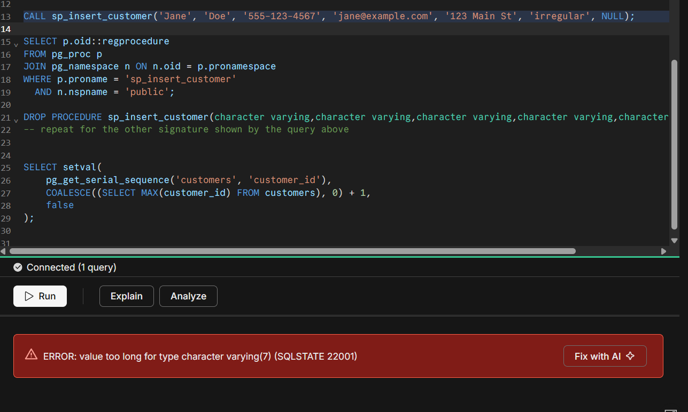
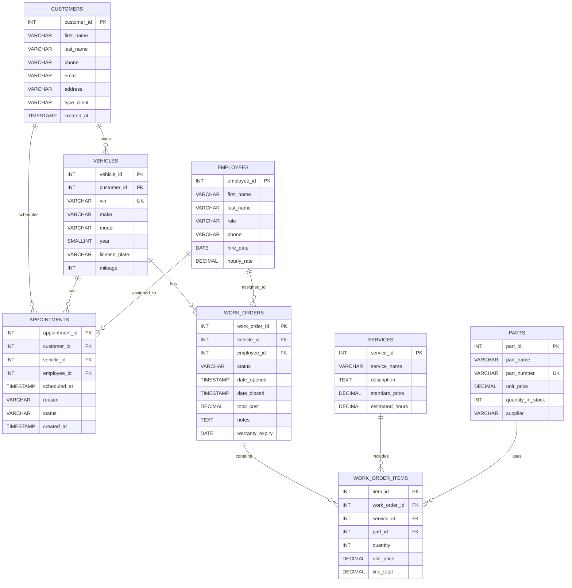

# Dominio de negocio

El dominio de negocio corresponde a un taller de reparación y mantenimiento de vehículos, encargado de gestionar la información de sus clientes, vehículos, empleados, servicios y repuestos. El sistema permite mantener un registro de los vehículos asociados a cada cliente y administrar el catálogo de servicios y las piezas disponibles en inventario, facilitando el control de las actividades realizadas por el taller.

El proceso principal se centra en las órdenes de trabajo, mediante las cuales se registra la atención realizada a un vehículo. Cada orden puede ser asignada a un empleado y contiene los diferentes servicios y repuestos utilizados, junto con sus cantidades y precios. De esta manera, el modelo permite realizar un seguimiento de cada reparación desde su apertura hasta su cierre, incluyendo el estado de la orden y el costo total de los trabajos realizados.

# Diagrama de dominio

```mermaid
erDiagram
    CUSTOMERS ||--o{ VEHICLES : owns
    VEHICLES ||--o{ WORK_ORDERS : has
    EMPLOYEES ||--o{ WORK_ORDERS : assigned_to
    WORK_ORDERS ||--o{ WORK_ORDER_ITEMS : contains
    SERVICES ||--o{ WORK_ORDER_ITEMS : includes
    PARTS ||--o{ WORK_ORDER_ITEMS : uses

    CUSTOMERS {
        INT customer_id PK
        VARCHAR first_name
        VARCHAR last_name
        VARCHAR phone
        VARCHAR email
        VARCHAR address
        TIMESTAMP created_at
    }

    VEHICLES {
        INT vehicle_id PK
        INT customer_id FK
        VARCHAR vin UK
        VARCHAR make
        VARCHAR model
        SMALLINT year
        VARCHAR license_plate
        INT mileage
    }

    EMPLOYEES {
        INT employee_id PK
        VARCHAR first_name
        VARCHAR last_name
        VARCHAR role
        VARCHAR phone
        DATE hire_date
        DECIMAL hourly_rate
    }

    SERVICES {
        INT service_id PK
        VARCHAR service_name
        TEXT description
        DECIMAL standard_price
        DECIMAL estimated_hours
    }

    PARTS {
        INT part_id PK
        VARCHAR part_name
        VARCHAR part_number UK
        DECIMAL unit_price
        INT quantity_in_stock
        VARCHAR supplier
    }

    WORK_ORDERS {
        INT work_order_id PK
        INT vehicle_id FK
        INT employee_id FK
        VARCHAR status
        TIMESTAMP date_opened
        TIMESTAMP date_closed
        DECIMAL total_cost
        TEXT notes
    }

    WORK_ORDER_ITEMS {
        INT item_id PK
        INT work_order_id FK
        INT service_id FK
        INT part_id FK
        INT quantity
        DECIMAL unit_price
        DECIMAL line_total
    }

# Evolución y corrección del modelo mediante Roll Forward

Durante la evolución del modelo de datos se identificó un error en el diseño de la tabla `customers`, específicamente en el atributo `type_client`. Inicialmente se agregó este atributo con una longitud de únicamente 7 caracteres, considerando valores como `Regular`:

```sql
ALTER TABLE customers
ADD COLUMN type_client VARCHAR(7) DEFAULT 'Regular';
```

Sin embargo, posteriormente se intentó registrar un cliente cuyo tipo era `irregular`. Para realizar esta operación se utilizó el procedimiento almacenado `sp_insert_customer`:

```sql
CALL sp_insert_customer(
    'Jane',
    'Doe',
    '555-123-4567',
    'jane@example.com',
    '123 Main St',
    'irregular',
    NULL
);
```

La operación produjo un error debido a que el valor `irregular` tiene una longitud de 9 caracteres, mientras que la columna `type_client` únicamente permitía almacenar 7 caracteres. Este error permitió identificar una restricción de diseño demasiado limitada para los valores que debía manejar el atributo.

Como estrategia de **roll forward**, en lugar de revertir el cambio o eliminar la información existente, se realizó una nueva modificación sobre el esquema desplegado, aumentando la capacidad de la columna:

```sql
ALTER TABLE customers
ALTER COLUMN type_client TYPE VARCHAR(20);
```

Después de aplicar esta modificación, el procedimiento `sp_insert_customer` pudo ejecutarse correctamente con el valor `irregular`. De esta manera, el modelo evolucionó desde una definición inicial que no soportaba todos los valores requeridos hacia una versión corregida, manteniendo la estructura y los datos existentes.

## Evidencia del error

La siguiente evidencia muestra el error obtenido al intentar registrar el cliente con el valor `irregular`, debido a que excedía la longitud definida inicialmente para `type_client`.



## Corrección mediante Roll Forward

La corrección se realizó mediante una nueva modificación del esquema:

```sql
ALTER TABLE customers
ALTER COLUMN type_client TYPE VARCHAR(20);
```

Esta modificación permitió ampliar la longitud permitida para `type_client` sin eliminar la tabla ni reconstruir el esquema completo. Posteriormente, se verificó nuevamente la inserción del cliente, comprobando que el valor `irregular` podía almacenarse correctamente.

# Diagrama final despues de las migraciones implementadas

El siguiente diagrama representa el estado final del modelo transaccional después de aplicar las migraciones realizadas durante el desarrollo. Además de las entidades iniciales, se incorporó la gestión de citas mediante `APPOINTMENTS`, se agregó el atributo `type_client` a los clientes y `warranty_expiry` a las órdenes de trabajo.

La creación del índice `idx_work_orders_status` no se representa en el diagrama entidad-relación, ya que corresponde a un mecanismo de optimización para las consultas sobre el estado de las órdenes y no modifica las entidades ni sus relaciones.

